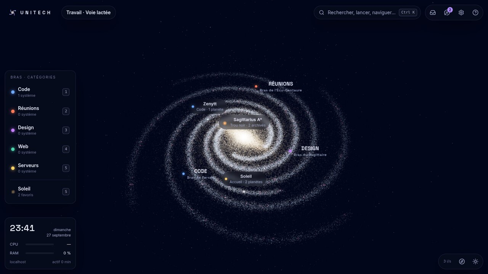
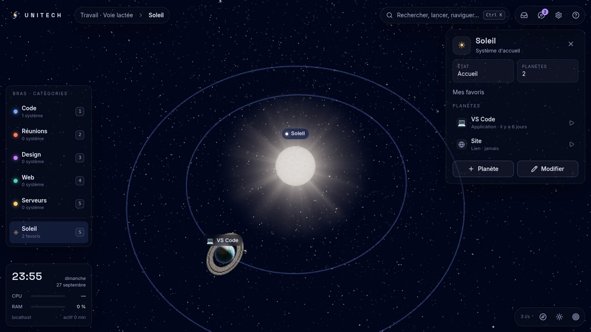
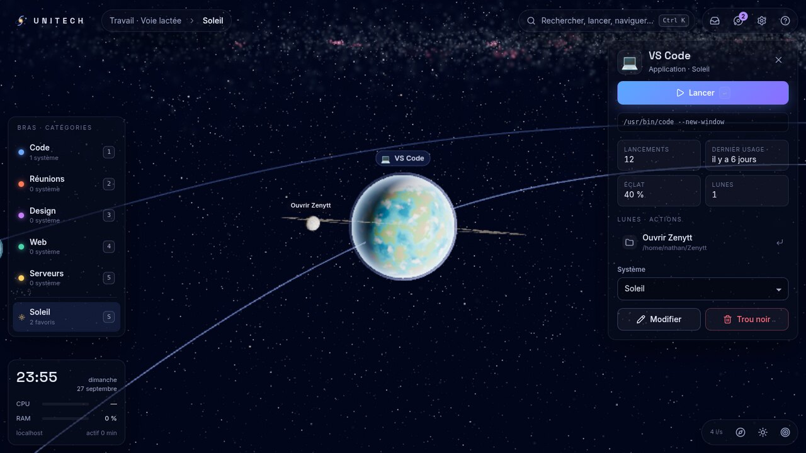
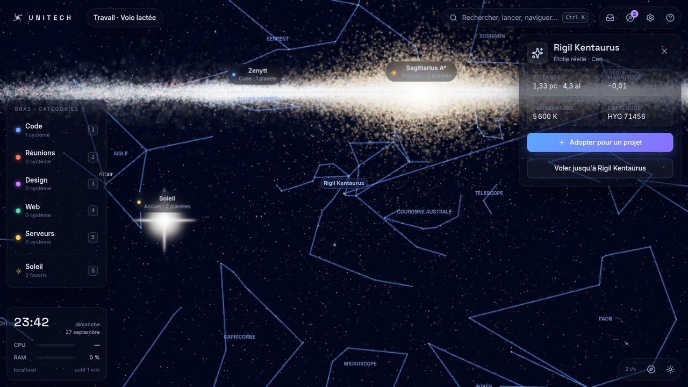

# Unitech

**Ton bureau est une galaxie.** Unitech est une application de bureau (Windows, macOS, Linux) qui
transforme tes applications, fichiers, dossiers, liens et commandes en une Voie lactée en 3D que
tu parcours et d'où tu lances tout.



- Les **bras spiraux** sont tes catégories, portés par les vrais bras de la Voie lactée (Persée,
  Écu-Centaure, Sagittaire, Règle, Orion), à leur vraie place autour du Soleil.
- Chaque **étoile** est un projet. Son état se lit à sa couleur : bleue si le projet est actif,
  naine rouge s'il est en pause, naine blanche s'il est en sommeil.
- Chaque **planète** est une application, un fichier, un dossier, un lien ou une commande. Plus tu
  l'utilises, plus elle grossit et brille. Une planète oubliée pâlit doucement, et une application
  ouverte pulse.
- Les **lunes** sont les actions secondaires d'une planète, par exemple « ouvrir le projet X dans
  VS Code ».
- Le **Soleil** est ton système d'accueil, pour tes favoris. Il est entouré de **109 400 vraies
  étoiles** (catalogue HYG) avec leurs positions, leurs couleurs et leur éclat réels, et on peut
  « adopter » Sirius ou Véga pour y installer un projet.
- Les **comètes** sont tes téléchargements récents, en orbite autour du Soleil. La **nébuleuse
  d'Orion** sert de boîte de réception.
- **Sagittarius A\***, le trou noir central, sert de corbeille : tout ce qui y est jeté reste
  restaurable.
- Les **stations** sont les widgets : heure, processeur, mémoire, durée de fonctionnement.

| Système d'accueil | Planète et ses lunes | Voisinage solaire et constellations |
| --- | --- | --- |
|  |  |  |

## Utilisation

| Action | Clavier / souris |
| --- | --- |
| Lanceur (rechercher, lancer, voler vers…) | `Ctrl K` (`⌘ K`), ou le raccourci global `Ctrl Maj Espace` même quand Unitech est en arrière-plan |
| Lancer une planète, entrer dans un système | `Entrée`, ou double-clic |
| Action secondaire dans le lanceur (y aller, ajouter, adopter…) | `Maj Entrée` |
| Revenir en arrière, désélectionner | `Échap` |
| Vue d'ensemble, Soleil, bras 1 à 5 | `H`, `S`, `1`–`5` |
| Nouvelle planète / nouveau système | `N` / `Maj N` |
| Modifier / envoyer au trou noir | `E` / `Suppr` |
| Annuler / rétablir | `Ctrl Z` / `Ctrl Maj Z` |
| Trou noir, nébuleuse, constellations, étiquettes | `B`, `I`, `C`, `L` |
| Tourner, déplacer, zoomer | glisser, clic droit (ou Maj), molette |

Quand la molette arrive au bout de sa course, on plonge dans le système sélectionné, ou on en
ressort. Un fichier, un dossier ou une application déposé sur la fenêtre devient une planète du
système affiché.

Au premier lancement, Unitech propose d'importer les applications installées :

- sous Linux, les entrées `.desktop` (XDG et Flatpak), avec leurs icônes et leurs catégories ;
- sous Windows, les raccourcis du menu Démarrer ;
- sous macOS, les paquets `.app`.

Chaque application est rangée d'office dans le bras qui correspond à sa catégorie.

### Côté bureau

- **Icône de notification** : ouvrir, lanceur, favoris (les planètes les plus utilisées), mode fond
  d'écran, quitter. Fermer la fenêtre la réduit dans la zone de notification (réglable).
- **Mode fond d'écran** : la galaxie passe en plein écran, derrière toutes les fenêtres, et
  disparaît de la barre des tâches. Le raccourci global la ramène au premier plan le temps d'une
  recherche. Ce n'est pas un vrai papier peint : les icônes du bureau restent masquées.
- **Démarrage automatique** avec la session (réduit dans la zone de notification).
- **Plusieurs galaxies** (Perso, Travail, Études…), chacune avec ses propres catégories.
- **Export et import** de l'espace de travail en JSON.

## Installation depuis les sources

Prérequis :

- Rust 1.88 ou plus récent ;
- Node.js 22 ou plus récent, avec pnpm 12 ;
- les [dépendances système de Tauri 2](https://v2.tauri.app/start/prerequisites/). Sous Debian ou
  Ubuntu : `libwebkit2gtk-4.1-dev libayatana-appindicator3-dev librsvg2-dev`.

```sh
pnpm install
pnpm app:dev      # application de bureau, rechargement à chaud
pnpm app:build    # installeurs dans target/release/bundle/
pnpm dev          # interface seule dans le navigateur (http://localhost:1430)
```

Dans le navigateur, l'espace de travail est gardé dans le stockage local et seules les planètes
« Lien » se lancent. C'est le mode utilisé pour développer l'interface et pour les captures.

Un tag `v*` déclenche la construction des installeurs (Windows, macOS universel, Linux)
par la CI, joints à un brouillon de release.

## Architecture

```
unitech/
├── crates/
│   ├── unitech-core/      modèle de l'espace de travail, validation, persistance atomique
│   ├── unitech-launcher/  lancement multiplateforme, .desktop, découverte des applis, icônes
│   └── unitech-system/    mesures des widgets, téléchargements récents, applis ouvertes
├── src-tauri/             application Tauri 2 : commandes, zone de notification, raccourci global
├── src/
│   ├── model/             types (miroir de Rust), opérations pures, recherche, usage
│   ├── engine/            moteur 3D three.js (voir ci-dessous)
│   ├── platform/          pont vers le bureau (Tauri) ou le navigateur
│   ├── store/             état zustand : espace de travail (annuler/rétablir, sauvegarde), interface
│   ├── app/               commandes de haut niveau partagées (lancer, voler, archiver…)
│   └── ui/                interface React : HUD, inspecteur, lanceur, éditeurs, panneaux
├── public/data/           étoiles réelles et constellations, précalculées
├── scripts/               préparation des données, icônes, captures d'écran
└── fixtures/              espaces de travail témoins, vérifiés par Rust et TypeScript
```

**Données.** Rust est la source de vérité du format. Chaque écriture passe par
`unitech_core::sanitize` : identifiants uniques, bornes, longueurs, couleurs, un seul Soleil par
galaxie. L'écriture est atomique (fichier temporaire, `fsync`, renommage) et garde une copie de
sécurité du fichier précédent. Un fichier illisible est mis de côté, jamais écrasé, et la copie
prend le relais. Un fichier écrit par une version plus récente est refusé. Les types TypeScript
sont vérifiés contre les mêmes fixtures JSON que Rust.

**Rendu.** La scène combine deux échelles :

- la **galaxie**, en parsecs, avec le centre galactique pour origine ;
- un **système**, en unités locales. Il est rendu par-dessus la galaxie, elle-même vue depuis la
  position du système : pas de problème de précision entre le kiloparsec et l'orbite d'une lune.

La Voie lactée est procédurale et déterministe (même graine, même galaxie). Ses bras sont des
spirales logarithmiques dont les rayons au passage du Soleil reproduisent l'ordre observé : Règle
à ~3,5 kpc, Écu-Centaure ~5, Sagittaire ~7, Orion avec le Soleil à 8,25, Persée ~10, bras
extérieur ~13. De 110 000 à 700 000 particules selon la qualité, générées dans un Web Worker, en
deux calques : lumière additive et poussière sombre.

Les vraies étoiles sont placées dans le repère galactique (rotation J2000 → galactique de l'IAU).
Leur éclat est recalculé pour la position de la caméra : en approchant de Sirius, elle grossit ;
depuis Véga, les constellations se déforment.

Les planètes ont des shaders procéduraux de sept types (rocheuse, désert, océan, glace, lave,
gazeuse, toxique), avec atmosphère, anneaux, terminateur et nuages. La post-production comprend un
bloom HDR, le tone mapping ACES et un anticrénelage MSAA. La résolution baisse d'elle-même si la
cadence chute, et la cadence est bridée quand la fenêtre n'a pas le focus.

**Pourquoi WebGL 2 et pas WebGPU.** Les moteurs web utilisés par Tauri (WebKitGTK, WKWebView,
WebView2) ne proposent pas encore tous WebGPU. WebGL 2 fonctionne partout, y compris en rendu
logiciel.

## Qualité

```sh
pnpm typecheck && pnpm test          # TypeScript strict + tests Vitest (modèle, recherche, génération, import)
pnpm test:rust && pnpm lint:rust     # tests Rust, rustfmt, clippy -D warnings
pnpm build && pnpm preview --port 4173 &
node scripts/screenshot.mjs          # visite guidée et captures (rendu logiciel, sans écran)
```

La CI (`.github/workflows/ci.yml`) exécute tout cela sous Linux. Elle lance aussi clippy et
les tests sous Windows et macOS.

## Données tierces

- Étoiles : [catalogue HYG v4.1](https://github.com/astronexus/HYG-Database) de David Nash,
  CC BY-SA 4.0. Les fichiers dérivés sont sous la même licence.
- Constellations : [d3-celestial](https://github.com/ofrohn/d3-celestial) d'Olaf Frohn, BSD 3
  clauses.
- Bruit procédural : [webgl-noise](https://github.com/ashima/webgl-noise), MIT.

Le détail est dans [`public/data/NOTICE.md`](public/data/NOTICE.md). Pour régénérer les données :
`pnpm data:stars <hygdata_v41.csv> <constellations.lines.json> <constellations.json>`.

## Pistes

- Modèles « héros » (stations des widgets, disque du trou noir, vaisseau-curseur) modélisés dans
  Blender et chargés en glTF (Draco/Meshopt, textures KTX2).
- Extraction des icônes d'applications sous Windows (`.exe`, `.lnk`) et macOS (`.icns`).
- Vrai papier peint animé sous Windows (fenêtre WorkerW) derrière les icônes du bureau.
- Pont avec Zenytt : chaque serveur devient une planète, dont la surface s'anime avec la charge
  processeur.
- Synchronisation chiffrée entre appareils ; VR (WebXR).

## Licence

Aucune licence n'est encore choisie : tous droits réservés à Nathan Chevrollier.
